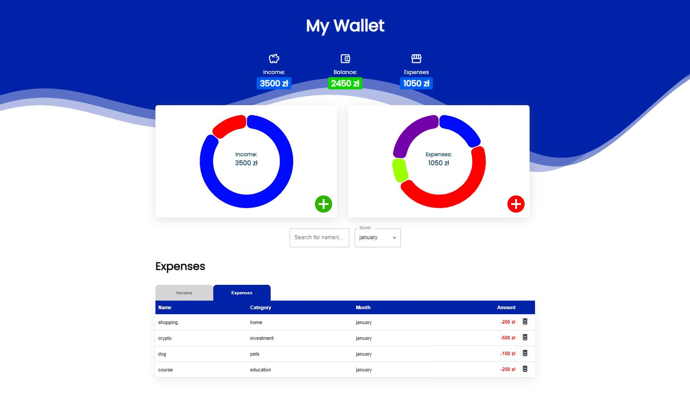

# Welcome to MyWallet!

## 💡 Concept
A web application allowing to track user's budget by adding income and expenses.
 
## 🔍 Project overview 
The app now stores data in localstorage but it is possible to add a database in the backend.
User can add income and/or expenses from a list of provided categories. Both income and expenses are set to localStorage. Data is added for a given month and it is possible to select the month to see the balance and all transactions for the specified time.

 
## 📦 Tech stack:
- React
- MUI + CSS Modules
- Chart.JS
 
## ⚙ TODO
- refactor code, possibly add Redux as a single store to manage all states,
- add a tab to see all the data together,
- add a calendar and more options to see, e.g. whole year or different timespans,
 
## 💻 Demo

Click the link and check the demo app: [MyWallet-link](https://ms-mywallet.netlify.app/)

## 💾 Installation

git clone https://github.com/marcinsuski/mywallet.git \
npm install\
npm start

## ☎️ Contact
In case of any comments or advice, You can e-mail me or use Issues :)

## 🧙‍♂️ Author
- GitHub - [Marcin Suski](https://github.com/marcinsuski)
- LinkedIn - [marcin-suski](https://www.linkedin.com/in/marcin-suski/)
- Porftolio - [marcinsuski.pl](https://marcinsuski.pl)
